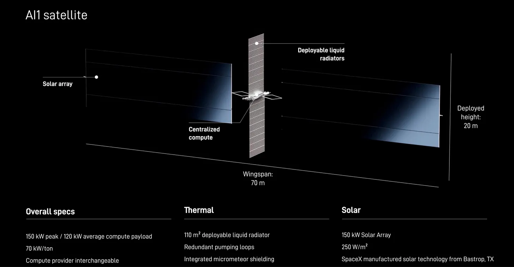

# FAQ

Common questions about the twilight simulation and the two brightness models.

Quotations attributed to SpaceX below are from "Brightness Mitigation Best
Practices for Satellite Operators," SpaceX, at
https://starlink.com/public-files/BrightnessMitigationBestPracticesSatelliteOperators.pdf

## Doesn't SpaceX plan to mitigate this?

Yes, and the blue column already assumes they do. It is built from the
measured on-orbit photometry of a Starlink satellite that is *currently
flying in its brightness mitigation mode*. It is not a guess about what
mitigation might achieve. It is what mitigation has already achieved on real
hardware, scaled up for the larger spacecraft.

So the blue column is not the optimistic-because-hopeful case. It is the
optimistic-because-measured case. The open question is whether that
performance transfers to a satellite roughly six times larger with a
different shape.

## Musk said the radiator is knife-edge to the Sun. Doesn't that solve it?

Reference is the video you can find at the SpaceX Starmind site:
https://www.spacex.com/spacexai/starmind

It's a good design choice. The
same description has the solar arrays held face-on to the Sun, and the
arrays are the large area. A radiator presenting its edge contributes very
little reflecting surface either way. The array orientation is what drives
the brightness, and pointing arrays at the Sun is what a data center in
orbit has to do to make power.

## Why not use Starlink V3 data? Isn't that what AI1 is based on?

Because there isn't any. V3 has flown once, on a suborbital path with a
perigee around 43 km. It reentered in roughly 20 minutes and was never
cataloged, so nobody has measured its brightness on orbit. Gen2 Mini is the
most recent SpaceX hardware that has actually flown in a stable orbit and
been photometrically characterized, which is why it is the anchor.

## Are these visible to the naked eye, or only in a long exposure?

Naked eye. The threshold is V = 6, the conventional limit for unaided
vision at a dark site, and atmospheric extinction is applied. Nothing here
is a stacked or long-exposure astrophotograph.

This is also the standard SpaceX sets for itself. Its brightness mitigation
document states the goal as making its satellites "invisible to the naked
eye when they are on station serving users." The metric used here is theirs,
not one invented for this simulation.

## Isn't this only a twilight problem?

That is precisely what the two models disagree about, and why the last row
matters most. The blue model says yes: by 90 minutes after sunset the count
reaches zero, because the satellites have entered Earth's shadow or dropped
below the visibility threshold. The orange model says no: roughly 28,300
would still be visible at that time.

## Why do they go dark at all? I thought sun-synchronous orbits stay lit.

Only above about 1,391 km. Sun-synchronous precession tracks Earth's pole,
not the ecliptic, and Earth's axial tilt swings the shadow cone through the
orbit plane over the year. The filed altitudes, 565 to 1,002 km, are all
below that threshold, so these satellites do pass through eclipse.

SpaceX describes the same effect in its own brightness mitigation document:
satellites at 1,200 km "are visible at midnight to observatories like the
Vera Rubin Observatory," while SpaceX's own lower satellites are not. The
zero in the last row of the table is that physics, not a modeling choice.

## Doesn't the terminator maneuver cost SpaceX power? Why would AI1 skip it?

It costs 25%. SpaceX states in the same document that pointing the arrays
away from the Sun at the terminator "results in a 25% reduction in available
power for the satellite," and that the second-generation satellite was
specifically designed to accommodate it.

That is a real commitment and worth crediting. But Gen2 is a communications
satellite, and giving up a quarter of its power costs it some link capacity.
AI1 is a data center. Power *is* the product, and the compute it sells is
what that power buys. Whether the same trade is affordable when it comes
directly out of the revenue-generating function has not been addressed
publicly. This is the single largest unknown behind the gap in the table.

## What about satellites that are not in their normal operating attitude?

Neither model accounts for them, and both are floors because of it. SpaceX's
own document lists four phases where its satellites are expected to be
brighter than their on-station brightness: the first orbits after launch,
orbit raise (where they explicitly "aren't able to perform solar array
off-pointing"), station-keeping and collision-avoidance burns, and deorbit.

For a constellation of 500,000 satellites with finite service lifetimes, a
meaningful number are in one of those phases at any given moment. Add the
roughly 1% on-orbit failure rate seen in Starlink, where an uncontrolled
satellite tumbles and can glint off 800 m2 of surface, and the real sky is
brighter than either column here.

## How far apart are the satellites from each other?

Three answers, because it depends what you mean.

**Along a single orbit**, roughly 10 km. Each plane holds about 4,200 to
4,800 satellites spread evenly around a circumference of about 44,000 km.
This number is solid: it follows directly from the filed counts and the
orbit size.

**Nearest neighbour in 3D**, a median of about 7 km. Treat this one as
indicative rather than precise. The satellites here are given random
phasing within each plane, because SpaceX has not published its phasing
scheme. A real constellation is phased deliberately to control close
approaches, so the low tail of this distribution is an artifact of the
model and should not be read as a conjunction analysis.

**How far apart they look**, about 0.8 degrees for two neighbours in the
same train passing overhead. That is the 10 km along-track gap divided by
the roughly 750 km range, so a little wider than the full Moon, which is
0.52 degrees across.

That figure shrinks toward the horizon, because the same 10 km is seen from
farther away:

| elevation | range | apparent separation |
|---|---|---|
| 90 deg | 750 km | 0.76 deg |
| 45 deg | 1,010 km | 0.57 deg |
| 30 deg | 1,316 km | 0.44 deg |
| 10 deg | 2,262 km | 0.25 deg |
| 0 deg | 3,183 km | 0.18 deg |

This is why the rings read as continuous bands low in the sky and resolve
into separate points higher up. It is geometry, not a rendering effect.

Averaged a different way, over all satellites visible anywhere above the
horizon at sunset, the density works out to 3.2 per square degree under the
no-mitigation model and 0.56 under the mitigated one.

Run `spacing.py` to reproduce these.

## What about light pollution? Most people cannot see 1,612 stars anyway.

True, and it does not work the way you might expect. Raising the sky
background removes faint stars and faint satellites together, so the
question is which loses more.

| limiting magnitude | site | stars | no-mitigation | mitigated |
|---|---|---|---|---|
| V < 6 | dark rural | 1,612 | 66,316 | 11,518 |
| V < 5 | outer suburb | 515 | 59,035 | 3,026 |
| V < 4 | suburban | 165 | 46,270 | 206 |
| V < 3 | inner city | 59 | 33,663 | 0 |

Light pollution separates the two models rather than equalising them. The
mitigated satellites are faint, so city light erases them completely. The
unmitigated ones are bright enough to punch through, and in a city sky
where only 59 stars remain you would be looking at roughly 33,000
satellites, outnumbering the stars by more than 500 to 1.

## The filing says 1,000,000 satellites. Why simulate 500,000?

The 500,000 here are the sun-synchronous groups, which is roughly half the
filed cap. The remainder sit near 30 degrees inclination and are not
included. That component contributes most heavily at low and mid latitudes,
so these counts are a floor rather than a full estimate.

## Aren't there already thousands of satellites? What's different?

Scale. There are currently something on the order of 10,000 active
satellites in total. This is a single proposed constellation roughly fifty
times that number, concentrated in dawn-dusk orbits, which are exactly the
orbits that stay sunlit while the ground below is dark.

## Isn't the simulation just tuned to look alarming?

The counts are the claim, and they are reproducible from the code with
numpy alone. Both brightness models come from published papers and are
implemented unchanged. The renderer's exposure and glow settings are a
presentation choice with no physical meaning, which is why the renderer is
not included and the count script is.

## Was this made with AI?

The imagery is not generative AI. Every satellite in the video is at a
position computed from an orbit propagator, and its brightness comes from
a published photometric model. Nothing in it was drawn, imagined, or
inpainted by an image model.

AI was used as a coding and writing assistant. See the declaration at the
end of the README for the specifics.

## Are you against this being built?

No. The point of showing two models rather than one is that the outcome is
not determined yet. The gap between the columns is a design decision that
has not been made public. If the mitigation transfers, this is a manageable
twilight effect. That is a good outcome and it is worth knowing whether it
is the one we are getting.

## What single number would settle this?

An expected visual magnitude for AI1 with its phase function, at a stated
range and attitude. One published curve collapses the entire range in this
simulation. Everything else here is an attempt to bracket a quantity that
SpaceX already knows and has not released.

## Why Blacksburg, Virginia?

It is where I am, and at 37 degrees north it is a fairly typical
mid-latitude site. Counts increase toward higher latitudes, where
dawn-dusk orbits spend more time sunlit relative to the observer, and
decrease toward the equator.
