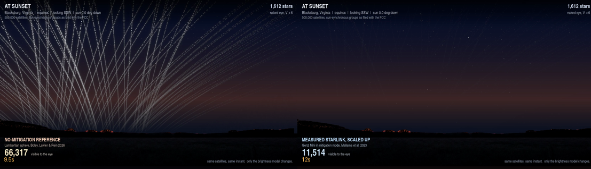

# How bright could SpaceX’s proposed orbital data centers be?

Reproducible counts behind the twilight simulation. Two published brightness
models with the same 500,000 satellites, same orbits, and same viewing site. 
Only the brightness model is different.

Shane Ross, Aerospace and Ocean Engineering, Virginia Tech.

[](https://youtu.be/LBZeKyh72q4)

*Illustrative ground-level rendering from Blacksburg, Virginia. Quantitative results are reported in the table below.*

[Resulting video](https://youtu.be/LBZeKyh72q4)

## Brightness result

Instantaneous counts of satellites visible to the unaided eye from Blacksburg,
Virginia (37 N) at the equinox, under a naturally dark sky.

The naked-eye threshold is **not** held fixed. It is computed at each epoch
from the brightness of the twilight sky: an empirical zenith sky-brightness
fit based on the Paranal twilight photometry of Patat et al. (2006),
converted to a limiting magnitude by the Schaefer relation. At sunset the sky
is far too bright for anything near sixth magnitude to be seen, and the limit
only reaches its dark-sky value about 90 minutes later.

The last two columns repeat the counts under the stricter reporting
conventions of Boley, Lawler & Rein: satellites above 10 degrees elevation
rather than merely above the horizon, V < 5, and counts shown only once the
Sun is 6 degrees or more below the horizon. Those are the figures to compare
against their paper.

| after sunset | sun el | V limit | unmitigated | mitigated | stars | unmit (Boley conv.) | mitig (Boley conv.) |
|---|---|---|---|---|---|---|---|
| 0 min | 0.0 | -6.90 | 0 | 0 | 0 | - | - |
| 30 min | -6.0 | -0.64 | 151 | 0 | 1 | - | - |
| 60 min | -11.9 | 5.01 | 33,496 | 0 | 536 | 26,923 | 0 |
| **68 min** | -13.5 | 5.89 | **37,704** | 550 | 1,440 | **24,199** | 0 |
| 90 min | -17.7 | 6.49 | 32,310 | 720 | 2,868 | 15,741 | 0 |
| 120 min | -23.5 | 6.48 | 18,569 | 0 | 2,831 | 8,051 | 0 |
| 150 min | -29.0 | 6.48 | 8,899 | 0 | 2,831 | 1,072 | 0 |
| 180 min | -34.3 | 6.48 | 1,134 | 0 | 2,831 | 0 | 0 |

Three things follow.

**Nothing is visible in either case for roughly the first 25 minutes.** The
sky is simply too bright. This is not a sunset phenomenon.

**The unmitigated case peaks about an hour after sunset**, near 37,700
satellites, against roughly 1,400 stars visible at that same moment. It is
still near 18,600 two hours out, and reaches zero at about 3 hours 20 minutes,
not because the satellites are all eclipsed but because the ones still lit are
low on the horizon at long range.

**The mitigated case never exceeds about 1,300**, fewer than the stars visible
at the same moment, and is gone by two hours. Under Boley's V < 5 convention it
is zero at every epoch, because the brightest mitigated satellite anywhere in
the constellation is V = 5.37.

The gap between the two cases is the main result. Neither column is a
prediction, and they are not strict mathematical bounds. They are two
reference cases using identical orbits, sky, and observing conditions. An
AI1-specific magnitude and phase function would substantially narrow the
uncertainty.

Reproduce with `python3 counts_twilight.py`. Artificial skyglow makes the
contrast sharper rather than softer, since it erases the faint mitigated
satellites entirely while the bright unmitigated ones survive and the stars
fade fastest of all; `python3 counts_twilight.py 4` runs a Bortle 4 site.

### Earlier version of this table

The first published version applied a flat V < 6 at every epoch and reported
66,300 at sunset. That is a *dark-sky* threshold, and applying it during bright
twilight credits the satellites with a detection limit the sky does not permit.
Raised by @Obserfessor on X, and correct. `counts.py` still reproduces those
figures, which remain valid as counts of satellites brighter than V = 6; it was
the phrase "visible to the naked eye" that did not hold at the early epochs.
The correction relocates the result rather than shrinking it.

## The two models

**Boley, Lawler & Rein 2026**, [arXiv:2608.02757](https://arxiv.org/abs/2608.02757),
their equation 2. A Lambertian sphere with zeta = albedo x area = 0.2 x 800 m2.
This is the authors’ idealized unmitigated reference case. It is implemented 
unchanged in `lsm.observe`.

Original model implementation and constellation files:
https://github.com/norabolig/odc_sky_impacts

**Mallama et al. 2023**, [arXiv:2306.06657](https://arxiv.org/abs/2306.06657).
The measured on-orbit phase function of Starlink Gen2 Mini in its brightness
mitigation mode, scaled to the AI1 array area by making it 1.97 magnitudes 
brighter; AI1 (710 m2) compared to the Mini's (116 m2) gives ratio 710/116.
Implemented in `lsm.observe_empirical`.

Gen2 Mini is used because it is the latest SpaceX design for which published
on-orbit photometry was available when this repository was prepared.

**The second column is an optimistic brightness reference case, not a prediction.** 
It assumes that the measured Gen2 Mini mitigation performance transfers 
directly to a spacecraft roughly six times larger. [SpaceX states](https://starlink.com/public-files/BrightnessMitigationBestPracticesSatelliteOperators.pdf) that Gen2 
terminator tracking points the solar arrays away from the Sun and reduces 
available power by 25%. Whether AI1 can or will use the same maneuver has 
not been published. Differences in attitude, geometry, materials, and 
projected area could therefore produce a different result.

## Constellation

The constellation is constructed from the sun-synchronous groups in Table 1 
of SpaceX’s May 29, 2026 FCC supplement. The LTAN placement and RAAN spread 
are additional modeling assumptions described below.

| altitude (km) | inclination (deg) | planes | node families |
|---|---|---|---|
| 565 - 585 | 97.7 | 10 | 2 |
| 707 - 744 | 97.2 | 22 | 2 |
| 967 - 1002 | 99.4 | 22 | 2 |

500,000 satellites, the sun-synchronous half of the filed 1,000,000 cap.
Dawn-dusk orbits, LTAN 06:00 and 18:00, with a 10 degree RAAN spread, which
is the "relaxed" case in Boley et al.

**Not included:** the approximately ~30 degree inclination shells in the same 
supplement. These results therefore describe only the 500,000-satellite 
sun-synchronous component, not the complete one-million-satellite filing.

## Running it

Requires Python 3 and NumPy.

```
python3 counts_twilight.py      # the table above
python3 counts_twilight.py 4    # same, for a Bortle 4 site
python3 counts.py               # the earlier flat V < 6 version
```

`counts.py` also prints the min and max over ten minutes of orbital phase, so
you can see how stable the counts are: in the 66,300-satellite case it varies
by about 20 satellites over the interval. The epoch-to-epoch changes in the
table above are real, not sampling noise.

## Files

| file | what it is |
|---|---|
| `lsm.py` | photometry, orbit propagation, both brightness models |
| `counts.py` | reproduces the table |
| `counts_twilight.py` | the same counts with an epoch-dependent naked-eye limit |
| `twilight.py` | twilight sky brightness and limiting magnitude |
| `stars.py` | naked-eye star counts, from the standard catalogue tabulation |
| `spacing.py` | satellite-to-satellite spacing, three ways |
| `sensitivity.py` | how the counts move under a systematic brightness error |
| `ASSUMPTIONS.md` | every assumption, its provenance, and what is not modeled |

The renderer that produces the video is not included. It carries texture and
star catalog assets with their own licensing, and its exposure constants are
tuned by eye for legibility. They are a presentation choice and carry no
physical meaning. The video is an illustrative rendering. The reproducible 
quantitative output of this repository is the visibility count table above.

## Declaration of generative AI and AI-assisted technologies

During the preparation of this work the author used Claude to assist with
writing and refining the simulation code, cross-checking numerical results,
and editing text for clarity. The author reviewed and verified all output,
independently confirmed the numerical results against the published models
they implement, and takes full responsibility for the content.

To be specific about what this does and does not mean, because the
distinction matters for a piece of work whose subject is a picture of the
sky:

- **The imagery is not generative AI.** Every satellite in the video sits at
  a position produced by an orbit propagator, and its brightness comes from
  a published photometric model evaluated at that position. Nothing was
  drawn, imagined, upscaled, or inpainted by an image model.
- **The physics is not mine and is not an AI's.** Both brightness models
  come from manuscripts submitted to arXiv and are implemented unchanged. The
  constellation geometry comes from SpaceX's filing. Where I have made an
  assumption, it is listed in `ASSUMPTIONS.md` with its source.
- **The numbers are checkable.** `counts.py` reproduces every figure quoted,
  from `lsm.py`, using numpy alone. If the code is wrong, the error is
  visible and fixable, and I would rather someone find it than not.

## License

MIT for the code. Please cite the two papers above for the models, which are
theirs, not mine.
