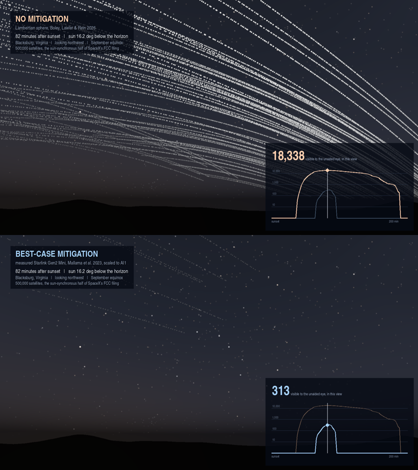
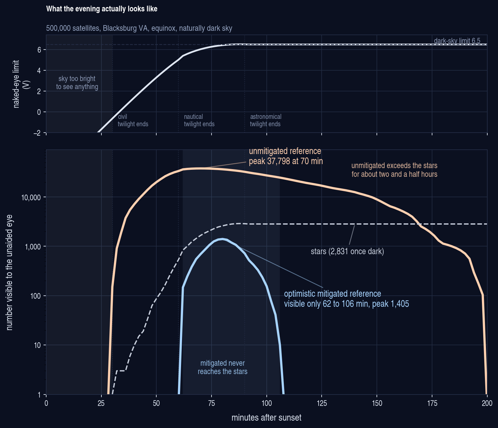

# How bright could SpaceX’s proposed orbital data centers be?

Reproducible counts behind the twilight simulation. Two published brightness
models with the same 500,000 satellites, same orbits, and same viewing site. 
Only the brightness model is different.

Shane Ross, Aerospace and Ocean Engineering, Virginia Tech.

[](https://youtu.be/YdqN9Zzxl-o)

*Illustrative ground-level rendering from Blacksburg, Virginia. Quantitative results are reported in the table below.*

[Resulting video (4K)](https://youtu.be/YdqN9Zzxl-o)

## Brightness result

Instantaneous counts of satellites visible to the unaided eye from Blacksburg,
Virginia (37 N) at the equinox, under a naturally dark sky.

The naked-eye threshold is **not** held fixed. It is computed at each epoch
from the brightness of the twilight sky: an empirical zenith sky-brightness
fit anchored to the Paranal twilight photometry of Patat et al. (2006),
converted to a limiting magnitude by the Schaefer relation. At sunset the sky
is far too bright for anything near sixth magnitude to be seen, and the limit
only reaches its dark-sky value about 90 minutes later.



*Regenerate with `python3 figure_evening.py`.*

| after sunset | sun el | V limit | unmitigated | mitigated | stars | |
|---|---|---|---|---|---|---|
| 0 min | 0.0 | -6.90 | 0 | 0 | 0 | *sunset* |
| 30 min | -6.0 | -0.64 | 151 | 0 | 0 | *first satellite appears* |
| 45 min | -8.9 | 2.37 | 12,522 | 0 | 13 | |
| 62 min | -12.3 | 5.39 | 36,136 | 147 | 756 | *mitigated case appears* |
| 70 min | -13.9 | 6.02 | **37,798** | 692 | 1,539 | *unmitigated peak* |
| 80 min | -15.8 | 6.41 | 36,308 | **1,405** | 2,376 | *mitigated peak* |
| 106 min | -20.8 | 6.48 | 24,639 | 10 | 2,565 | *mitigated case gone* |
| 120 min | -23.5 | 6.48 | 18,569 | 0 | 2,563 | |
| 150 min | -29.0 | 6.48 | 8,899 | 0 | 2,564 | |
| 198 min | -37.3 | 6.48 | 104 | 0 | 2,579 | *unmitigated gone* |

Four things follow.

**Nothing at all is visible for the first half hour.** The sky is simply too
bright. This is not a sunset phenomenon, and the earlier version of this table
was wrong to present it as one.

**The two cases are visible for very different lengths of time.** The
unmitigated case runs from 30 minutes to about 3 hours 20 minutes after sunset,
some two and a half hours of it with more satellites in the sky than stars. The
mitigated case is visible for only about 44 minutes, from 62 to 106 minutes.

**They do not even peak at the same time.** The unmitigated case peaks at 70
minutes, the mitigated case at 80, because the second is still being uncovered
by the darkening sky when the first has already begun to be eclipsed.

**At the equinox the mitigated case stays below the stars.** Its maximum of
about 1,405 is a little over half the 2,565 stars visible once the sky is fully
dark. The unmitigated case exceeds the stars by more than ten to one at peak.
This is an equinox result and it does **not** hold through the year. See the
seasonal table below, which is the strongest reason not to quote a single
number for the mitigated case.

Under the stricter reporting conventions of Boley, Lawler & Rein (satellites
above 10 degrees elevation, V < 5, counts shown only once the Sun is 6 degrees
down) the unmitigated peak is about 24,200 and the mitigated case is zero at
every epoch, because the brightest mitigated satellite anywhere in the
constellation is V = 5.37. Those are the figures to compare against their paper,
and `counts_twilight.py` prints both conventions side by side.

The gap between the two cases is the main result. Neither column is a
prediction, and they are not strict mathematical bounds. They are two
reference cases using identical orbits, sky, and observing conditions. An
AI1-specific magnitude and phase function would substantially narrow the
uncertainty.

Reproduce with `python3 counts_twilight.py`. Artificial skyglow makes the
contrast sharper rather than softer, since it erases the faint mitigated
satellites entirely while the bright unmitigated ones survive and the stars
fade fastest of all; `python3 counts_twilight.py 4` runs a Bortle 4 site.

## The season matters more than anything else in this repository

Every table above is for an equinox, which turns out to be close to the
quietest time of year. Running the same calculation month by month, whole sky
from Blacksburg under a dark sky, at each model's own peak:

| date | unmitigated | mitigated | stars | mitigated / stars | mitigated visible |
|---|---|---|---|---|---|
| Jan | 63,523 | 12,165 | 2,192 | 5.6 | 52 to 160 min |
| Feb | 54,458 | 6,564 | 2,495 | 2.6 | 50 to 132 min |
| Mar equinox | 37,568 | 1,334 | 2,527 | 0.5 | 62 to 104 min |
| Apr 20 | 16,965 | 0 | 1,086 | 0 | none |
| May 21 | 2,648 | 0 | 1,160 | 0 | none |
| Jun solstice | 759 | 0 | 917 | 0 | none |
| Jul 22 | 2,883 | 0 | 1,310 | 0 | none |
| Aug 22 | 17,483 | 0 | 1,110 | 0 | none |
| Sep equinox | 37,803 | 1,401 | 2,376 | 0.6 | 62 to 106 min |
| Oct | 55,853 | 6,987 | 2,350 | 3.0 | 50 to 134 min |
| Nov | 63,439 | 12,308 | 2,087 | 5.9 | 52 to 162 min |
| Dec solstice | 62,272 | **13,745** | 2,602 | **5.3** | 54 to 172 min |

Reproduce with `python3 seasonal.py`, or `python3 seasonal.py 55` for another
latitude. Each row is one date; the months are sampled, not averaged.

The mitigated case falls to zero between about **13 April and 30 August** at
this latitude, and it does not fade out gently: it drops from 258 on 2 April
to 69 on 8 April to nothing by 14 April, and comes back just as fast at the
end of August.

**This corrects a claim made in earlier versions of this file and in the
LinkedIn post.** The statement that the optimistic mitigated case never
approaches the star count is true at an equinox and false for roughly half the
year. Near the December solstice it outnumbers the stars by about five to one,
and it stays visible for close to three hours rather than forty minutes.

The mechanism is phase angle. A dawn-dusk sun-synchronous orbit fixes the
satellites relative to the day-night line, but not relative to the Sun's
declination, so the Sun-satellite-observer angle swings through the year. Near
a solstice the satellites are front-lit at small phase angles, where the
measured Gen2 Mini phase function is several magnitudes brighter than at the
side-lit angles of an equinox. The idealized Lambertian sphere has a far weaker
phase dependence, which is why the unmitigated column moves by a factor of
about 80 across the year while the mitigated column moves from zero to 13,745.

Two things follow that matter more than the equinox numbers.

**The optimistic case is not a floor.** It is a reference case computed at one
geometry, and its own seasonal range is larger than the gap between the two
models at an equinox. Any single quoted value for it, including the 1,405 in
the table above, is a statement about one date.

**The quiet half of the year is quiet for a reason that will not last.** From
April to August the satellites spend most of the night in Earth's shadow at
this latitude. That is a property of the altitudes in the current filing, not a
general protection: the eclipse threshold for a dawn-dusk sun-synchronous ring
is 1,391 km, and a constellation placed above it would not have a quiet season.

### Earlier versions of this table

**Star counts, corrected.** Earlier versions counted stars from the isotropic
synthetic sky in `stars.py`, which spreads the standard whole-sky tabulation
evenly over the hemisphere. That overcounts what is really above the horizon
from Blacksburg at this date by about ten percent, and the dark-sky figure has
moved from 2,831 to 2,565. `counts_twilight.py` now counts real stars from the
HYG catalogue at the actual date and latitude. Only the star column changed;
no satellite number in this repository depends on it.

The first published version applied a flat V < 6 at every epoch and reported
66,300 at sunset. That is a *dark-sky* threshold, and applying it during bright
twilight credits the satellites with a detection limit the sky does not permit.
This improvement was suggested by @Obserfessor on X, and is now implemented.
`counts.py` still reproduces those figures, which remain valid as counts of satellites brighter than V = 6; it was
the phrase "visible to the naked eye" that did not hold at the early epochs.
The correction relocates the result rather than shrinking it.

## The two models

**Boley, Lawler & Rein 2026**, [arXiv:2608.02757](https://arxiv.org/abs/2608.02757),
their equation 2. A Lambertian sphere with zeta = albedo x area = 0.2 x 800 m2.
This is the authors’ idealized unmitigated reference case. It is implemented 
unchanged in `lsm.observe`.

Original model implementation and constellation files:
https://github.com/norabolig/odc_sky_impacts

**Mallama et al. 2023**, [arXiv:2306.06657](https://arxiv.org/abs/2306.06657).
The measured on-orbit phase function of Starlink Gen2 Mini in its brightness
mitigation mode, scaled to the AI1 array area by making it 1.97 magnitudes 
brighter; AI1 (710 m2) compared to the Mini's (116 m2) gives ratio 710/116.
Implemented in `lsm.observe_empirical`.

Gen2 Mini is used because it is the latest SpaceX design for which published
on-orbit photometry was available when this repository was prepared.

**The second column is an optimistic brightness reference case, not a prediction.** 
It assumes that the measured Gen2 Mini mitigation performance transfers 
directly to a spacecraft roughly six times larger. [SpaceX states](https://starlink.com/public-files/BrightnessMitigationBestPracticesSatelliteOperators.pdf) that Gen2 
terminator tracking points the solar arrays away from the Sun and reduces 
available power by 25%. Whether AI1 can or will use the same maneuver has 
not been published. Differences in attitude, geometry, materials, and 
projected area could therefore produce a different result.

## Constellation

The constellation is constructed from the sun-synchronous groups in Table 1 
of SpaceX’s May 29, 2026 FCC supplement. The LTAN placement and RAAN spread 
are additional modeling assumptions described below.

| altitude (km) | inclination (deg) | planes | node families |
|---|---|---|---|
| 565 - 585 | 97.7 | 10 | 2 |
| 707 - 744 | 97.2 | 22 | 2 |
| 967 - 1002 | 99.4 | 22 | 2 |

500,000 satellites, the sun-synchronous half of the filed 1,000,000 cap.
Dawn-dusk orbits, LTAN 06:00 and 18:00, with a 10 degree RAAN spread, which
is the "relaxed" case in Boley et al.

**Not included:** the approximately ~30 degree inclination shells in the same 
supplement. These results therefore describe only the 500,000-satellite 
sun-synchronous component, not the complete one-million-satellite filing.

## Running it

Requires Python 3 and NumPy.

```
python3 counts_twilight.py      # the table above
python3 counts_twilight.py 4    # same, for a Bortle 4 site
python3 counts.py               # the earlier flat V < 6 version
python3 seasonal.py             # the same peak, month by month
python3 seasonal.py 55          # any latitude
```

There is also an interactive version, which renders the whole sky for any
latitude, date and time and lets you drag it around in a browser:

```
pip install -r requirements.txt
streamlit run app.py
```

`counts.py` also prints the min and max over ten minutes of orbital phase, so
you can see how stable the counts are: in the 66,300-satellite case it varies
by about 20 satellites over the interval. The epoch-to-epoch changes in the
table above are real, not sampling noise.

## Files

| file | what it is |
|---|---|
| `lsm.py` | photometry, orbit propagation, both brightness models |
| `counts.py` | reproduces the table |
| `counts_twilight.py` | the same counts with an epoch-dependent naked-eye limit |
| `seasonal.py` | the same peak month by month, at any latitude |
| `figure_evening.py` | the figure above |
| `solar.py` | solar declination and right ascension, and sunset for a latitude |
| `skymodel.py` | twilight sky brightness over the whole dome |
| `realstars.py`, `hyg_naked_eye.npz` | 8,913 real naked-eye stars, HYG database |
| `frame.py` | composes one ground frame: sky, stars, satellites |
| `overlay.py` | the on-screen inset, labels and closing card |
| `current_sky.py` | the same counts for today's Starlink fleet, for comparison |
| `twilight.py` | twilight sky brightness and limiting magnitude |
| `stars.py` | naked-eye star counts, from the standard catalogue tabulation |
| `spacing.py` | satellite-to-satellite spacing, three ways |
| `sensitivity.py` | how the counts move under a systematic brightness error |
| `app.py` | the interactive version, for any latitude, date and time |
| `pano.py` | the whole dome as one panorama, for the app |
| `viewer.py` | the browser viewer: drag to look around, play the motion |
| `sky_view.py` | the app's bridge to the same physics the video uses |
| `ASSUMPTIONS.md` | every assumption, its provenance, and what is not modeled |

The ground renderer **is** included: `skymodel.py`, `realstars.py`, `frame.py`
and `overlay.py` produce the twilight frames. Every satellite drawn is one that
beats the sky brightness at its own position, so the number shown on a frame and
the dots in it agree by construction. Only the opening approach sequence is
left out, because it needs Earth surface textures with their own licensing.

Two conventions are in play and it is worth being explicit about which is which.
The tables above are **whole sky**, against the zenith limit, which is the right
basis for comparison with Boley et al. The video reports what is inside its own
95 degree frame, against the local sky at each point, which is about a quarter
of the sky and a stricter test. Peak values under each:

| | in the video's view | whole sky |
|---|---|---|
| no mitigation | 18,339 | 37,798 |
| best-case mitigation | 334 | 1,405 |

Neither is a correction of the other. They answer different questions.

## Declaration of generative AI and AI-assisted technologies

During the preparation of this work the author used Claude to assist with
writing and refining the simulation code, cross-checking numerical results,
and editing text for clarity. The author reviewed and verified all output,
independently confirmed the numerical results against the published models
they implement, and takes full responsibility for the content.

To be specific about what this does and does not mean, because the
distinction matters for a piece of work whose subject is a picture of the
sky:

- **The imagery is not generative AI.** Every satellite in the video sits at
  a position produced by an orbit propagator, and its brightness comes from
  a published photometric model evaluated at that position. Nothing was
  drawn, imagined, upscaled, or inpainted by an image model.
- **The physics is not mine and is not an AI's.** Both brightness models
  come from manuscripts submitted to arXiv and are implemented unchanged. The
  constellation geometry comes from SpaceX's filing. Where I have made an
  assumption, it is listed in `ASSUMPTIONS.md` with its source.
- **The numbers are checkable.** `counts.py` reproduces every figure quoted,
  from `lsm.py`, using numpy alone. If the code is wrong, the error is
  visible and fixable, and I would rather someone find it than not.

## License

MIT for the code. Please cite the two papers above for the models, which are
theirs, not mine.
